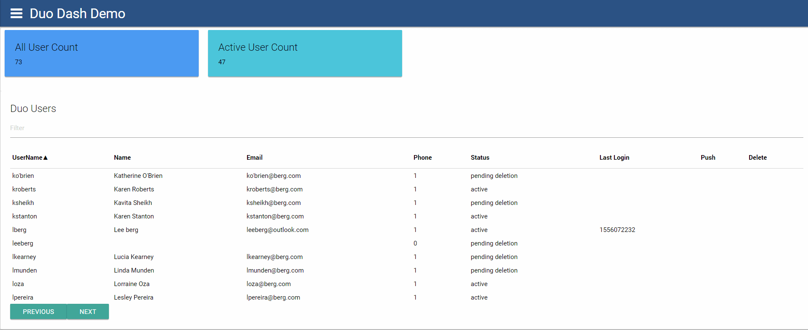
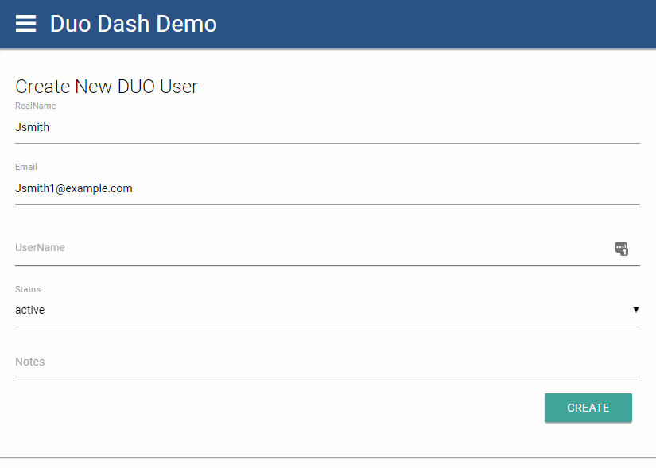
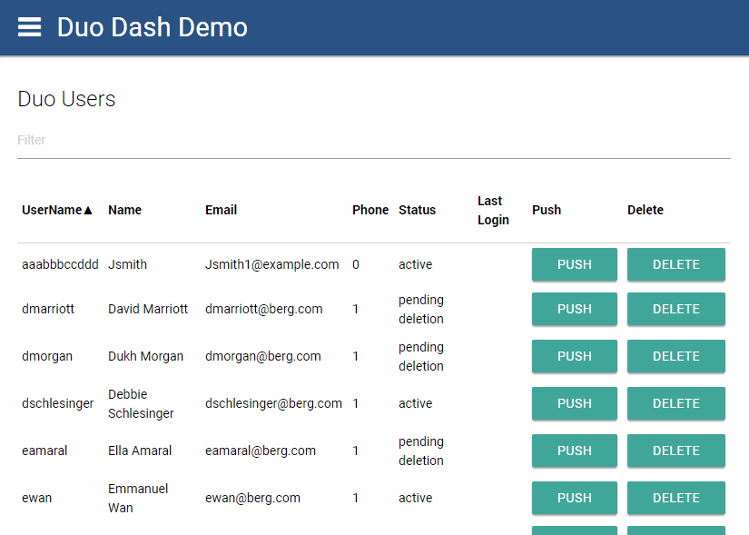
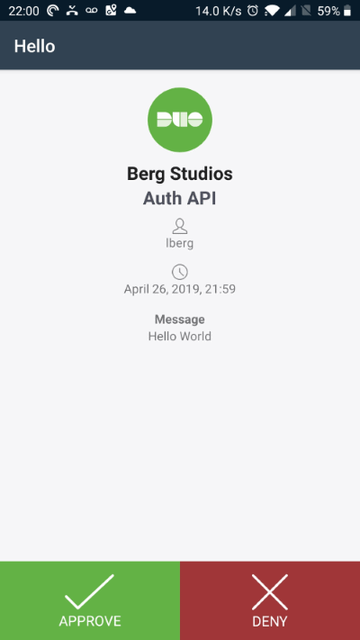

# DuoDashDemo

**DUO Dash Demo** is a simple DUO integration example built with the free open source community edition of [Universal Dashboard](https://universaldashboard.io/) by [Ironman Software](https://ironmansoftware.com). It was built in just over 1 hour on a [Twitch Stream](https://www.youtube.com/watch?v=UN_WvRi_BYg)

The demo relies entirely on the great [DUO Powershell Module](https://github.com/mbegan/Duo-PSModule) from [mbegan](https://github.com/mbegan). For this demo I have added a single new function to facilitate AUTH push.

## Features

1. Web dashboard to display and manage DUO users
2. Retrieve Status and Users from a DUO instance
3. Provision NEW Users to Duo Instance
4. Use the AUTH Api to send dynamic Auth Push

## Screenshots

**Home Page**

**Provisioning Users**

**Modify Honey Account**

**Push MFA Auth Request to User**

## Usage

1. Populate a Duo_org.ps1 file in the Modules folder as specified in the [DUO Powershell Module Documentation](https://github.com/mbegan/Duo-PSModule) 
2. Run the start.ps1 script